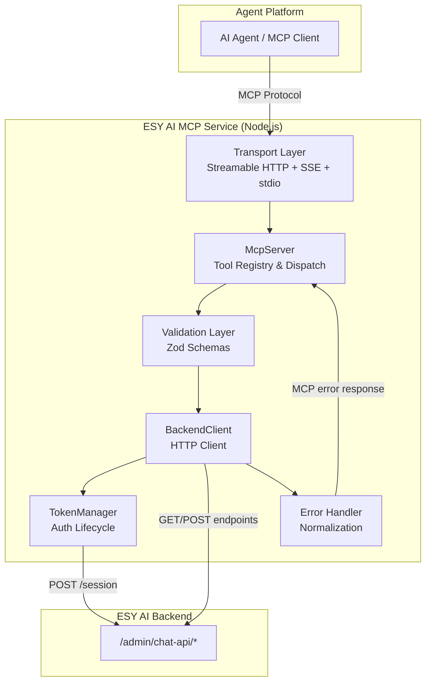
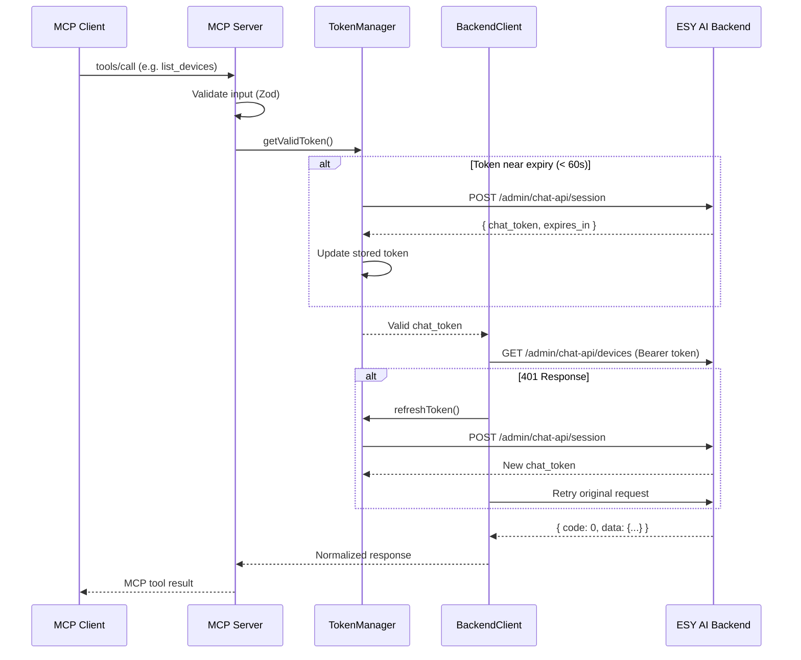
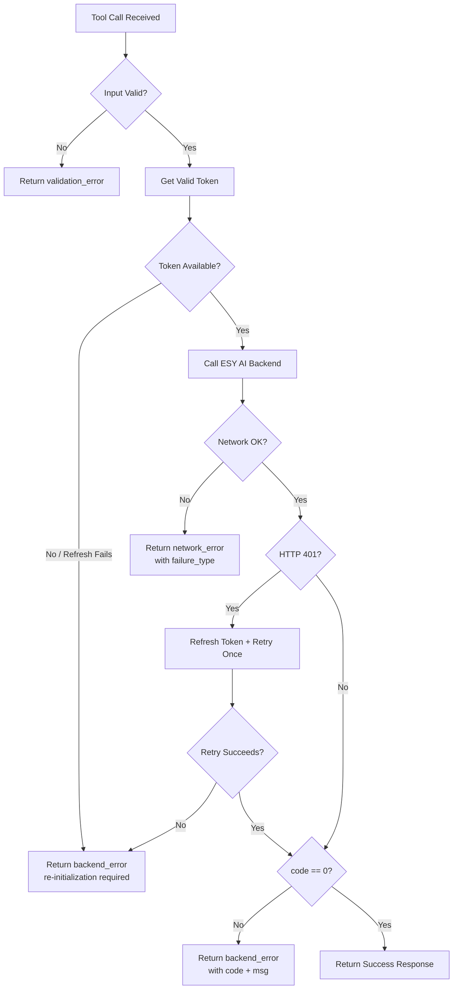

# Design Document: ESY AI MCP Service

## Overview

The ESY AI MCP Service is a Node.js/TypeScript application that implements the Model Context Protocol (MCP) to expose ESY AI backend APIs as MCP tools. It acts as a stateful middleware layer between an AI agent platform and the ESY AI backend, handling authentication token lifecycle, input validation, and error normalization.

### Key Design Decisions

1. **MCP SDK v2 (`@modelcontextprotocol/server`)** — Uses the official TypeScript SDK with `McpServer.registerTool()` and Zod v4 schemas for input validation. The SDK handles JSON Schema generation, argument validation, and protocol compliance automatically.

2. **Express + Streamable HTTP transport** — Uses `@modelcontextprotocol/express` for HTTP serving. The Streamable HTTP transport (protocol version 2025-03-26) supports both SSE streaming and direct HTTP responses on a single `/mcp` endpoint. Legacy SSE clients are supported via the SDK's built-in backward compatibility.

3. **Per-session token management** — Each MCP session maintains its own `ChatToken` with proactive refresh (60s before expiry), 401-triggered retry, and request queuing during refresh. The `TokenManager` class encapsulates this lifecycle.

4. **Shared validation layer** — All 11 tools share common validation patterns (pagination, device_id, timestamps) extracted into reusable Zod schemas and validator utilities.

## Architecture



### Request Flow



## Components and Interfaces

### Project Structure

```
esy-mcp/
├── src/
│   ├── index.ts                 # Entry point, env validation, server bootstrap
│   ├── server.ts                # McpServer factory, tool registration
│   ├── transport/
│   │   └── setup.ts             # Express app + Streamable HTTP handler setup
│   ├── auth/
│   │   └── token-manager.ts     # TokenManager class (lifecycle, refresh, queue)
│   ├── client/
│   │   └── backend-client.ts    # HTTP client for ESY AI backend
│   ├── tools/
│   │   ├── index.ts             # Tool registration orchestrator
│   │   ├── get-user-context.ts
│   │   ├── list-devices.ts
│   │   ├── get-device-details.ts
│   │   ├── get-device-status.ts
│   │   ├── get-latest-telemetry.ts
│   │   ├── get-telemetry-history.ts
│   │   ├── get-device-alarms.ts
│   │   ├── get-all-alarms.ts
│   │   ├── get-device-events.ts
│   │   ├── get-device-summary.ts
│   │   └── get-sites.ts
│   ├── schemas/
│   │   └── common.ts            # Shared Zod schemas (pagination, device_id, timestamps)
│   ├── errors/
│   │   └── index.ts             # Error types and normalization
│   └── types/
│       └── index.ts             # TypeScript interfaces
├── package.json
├── tsconfig.json
└── .env.example
```

### Core Components

#### 1. TokenManager (`src/auth/token-manager.ts`)

Manages the chat_token lifecycle including acquisition, proactive refresh, and request queuing.

```typescript
interface TokenManager {
  /** Initialize with a web_session_token, obtain initial chat_token */
  initialize(webSessionToken: string): Promise<void>;

  /** Get a valid token, refreshing proactively if within 60s of expiry */
  getValidToken(): Promise<string>;

  /** Force a refresh (called on 401), queues concurrent callers */
  refreshToken(): Promise<string>;

  /** Check if the manager has been initialized */
  isInitialized(): boolean;
}
```

**Internal state:**
- `chatToken: string | null` — Current token value
- `expiresAt: number` — Unix timestamp (seconds) when token expires
- `webSessionToken: string` — Stored for refresh calls
- `refreshPromise: Promise<string> | null` — Deduplication lock for concurrent refresh requests

**Refresh queueing pattern:**
```typescript
async refreshToken(): Promise<string> {
  // If a refresh is already in progress, piggyback on it
  if (this.refreshPromise) {
    return this.refreshPromise;
  }
  this.refreshPromise = this._doRefresh();
  try {
    return await this.refreshPromise;
  } finally {
    this.refreshPromise = null;
  }
}
```

#### 2. BackendClient (`src/client/backend-client.ts`)

HTTP client that wraps all ESY AI backend calls with token injection and 401 retry logic.

```typescript
interface BackendClient {
  /** Make an authenticated GET request to the backend */
  get<T>(path: string, params?: Record<string, string | number>): Promise<T>;

  /** Make an authenticated POST request to the backend */
  post<T>(path: string, body?: unknown): Promise<T>;
}
```

**Key behaviors:**
- Injects `Authorization: Bearer <chat_token>` header on every request
- 30-second request timeout (AbortController)
- On 401: calls `tokenManager.refreshToken()`, retries exactly once
- On network error: wraps as `NetworkError` with failure type
- On `code !== 0` response: wraps as `BackendError` with code and message

#### 3. McpServer Factory (`src/server.ts`)

Creates an `McpServer` instance and registers all 11 tools with Zod input schemas.

```typescript
function createEsyMcpServer(tokenManager: TokenManager, backendClient: BackendClient): McpServer;
```

#### 4. Transport Setup (`src/transport/setup.ts`)

Configures Express with the MCP handler for Streamable HTTP + SSE support.

```typescript
function createTransportApp(serverFactory: () => McpServer): Express;
```

Uses `createMcpExpressApp()` with `toNodeHandler(createMcpHandler(factory))` mounted on `POST /mcp` and `GET /mcp` (for SSE streaming).

### Tool Interface Pattern

Each tool file exports a registration function:

```typescript
// src/tools/list-devices.ts
import { McpServer } from '@modelcontextprotocol/server';
import * as z from 'zod/v4';
import { BackendClient } from '../client/backend-client';
import { paginationSchema, deviceIdSchema } from '../schemas/common';

export function registerListDevices(server: McpServer, client: BackendClient): void {
  server.registerTool(
    'list_devices',
    {
      description: 'List and filter IoT devices in the fleet',
      inputSchema: z.object({
        keyword: z.string().max(100).optional(),
        status: z.string().optional(),
        device_type: z.string().optional(),
        model: z.string().optional(),
        site_id: z.string().optional(),
        alarm_status: z.string().optional(),
        page: z.number().int().min(1).optional(),
        page_size: z.number().int().min(1).max(100).optional(),
      }),
    },
    async (params) => {
      const result = await client.get('/admin/chat-api/devices', {
        ...params,
        page: params.page ?? 1,
        page_size: params.page_size ?? 20,
      });
      return { content: [{ type: 'text', text: JSON.stringify(result) }] };
    }
  );
}
```

## Data Models

### Token State

```typescript
interface TokenState {
  chat_token: string;
  expires_at: number;       // Unix seconds (current_time + expires_in)
  web_session_token: string; // Stored for refresh calls
}
```

### ESY AI Backend Response Envelope

```typescript
interface EsyApiResponse<T> {
  code: number;     // 0 = success, non-zero = error
  msg: string;      // Human-readable message
  data: T;          // Payload (shape varies by endpoint)
}
```

### MCP Tool Response Types

```typescript
// Success response (returned as MCP text content)
interface ToolSuccessPayload {
  [key: string]: unknown; // snake_case fields from backend data
}

// Error response (returned as MCP isError content)
interface ToolErrorPayload {
  error_type: 'backend_error' | 'network_error' | 'validation_error';
  error_code?: number;       // Backend error code (for backend_error)
  error_message: string;     // Human-readable description
  parameter?: string;        // Invalid parameter name (for validation_error)
  expected_type?: string;    // Expected type (for validation_error)
  received_type?: string;    // Received type (for validation_error)
  failure_type?: string;     // timeout | connection_refused | dns_failure (for network_error)
}
```

### Domain Models (Backend Response Shapes)

```typescript
interface UserContext {
  user_id: string;
  user_name: string;
  tenant_id: string;
  tenant_name: string;
  role: string;
  permissions: string[];
}

interface DeviceListItem {
  device_id: string;
  device_name: string;
  serial_number: string;
  sn: string;
  device_type: string;
  model: string;
  site_id: string;
  site_name: string;
  status: string;
  alarm_status: string;
}

interface DeviceDetails extends DeviceListItem {
  install_location: string;
  install_time: number;      // Unix seconds
  country_code: string;
  time_zone_id: string;
}

interface DeviceStatus {
  device_id: string;
  device_name: string;
  online_status: 'online' | 'offline' | 'upgrade';
  running_status: 'running' | 'standby' | 'starting' | 'stopped' | 'unknown';
  alarm_status: 'alarm' | 'normal';
  last_online_time: number;  // Unix seconds
  data_time: number;         // Unix seconds
}

interface TelemetryMetric {
  value: number | null;
  unit: string;
}

interface LatestTelemetry {
  device_id: string;
  data_time: number;         // Unix seconds
  pvPower: TelemetryMetric;
  loadPower: TelemetryMetric;
  batteryPower: TelemetryMetric;
  gridPower: TelemetryMetric;
  batterySoc: TelemetryMetric;
}

interface TelemetryHistoryItem {
  time: number;              // Unix seconds
  pv_power: number | null;
  load_power: number | null;
  battery_power: number | null;
  grid_power: number | null;
  battery_soc: number | null;
}

interface AlarmItem {
  alarm_id: string;
  device_id: string;
  device_name: string;
  sn: string;
  alarm_code: string;
  alarm_name: string;
  alarm_level: string;
  alarm_status: string;
  start_time: number;        // Unix seconds
  end_time: number | null;   // Unix seconds, null if active
  possible_causes: string;
  solutions: string;
}

interface EventItem {
  event_type: string;
  event_name: string;
  event_time: number;        // Unix seconds
  detail?: string;
}

interface DeviceSummary {
  total: number;
  online: number;
  offline: number;
  running: number;
  stopped: number;
  alarm_devices: number;
  active_alarms: number;
}

interface SiteItem {
  installer_id: string;
  company_name: string;
  device_count: number;
}
```

### Shared Zod Schemas (`src/schemas/common.ts`)

```typescript
import * as z from 'zod/v4';

export const deviceIdSchema = z.string().min(1).regex(/^\d+$/, 'device_id must be a numeric identifier');

export const paginationSchema = z.object({
  page: z.number().int().min(1).optional(),
  page_size: z.number().int().min(1).max(100).optional(),
});

export const timestampSchema = z.number().int().min(0);

export const timeRangeSchema = z.object({
  start_time: timestampSchema.optional(),
  end_time: timestampSchema.optional(),
}).refine(
  (data) => !(data.start_time && data.end_time && data.start_time > data.end_time),
  { message: 'start_time must not be later than end_time' }
);

export const alarmLevelSchema = z.enum(['1', '2', '3', 'level_1', 'level_2', 'level_3']);

export const alarmStatusSchema = z.enum(['active', 'recovered', 'handled']);

export const eventTypeSchema = z.enum(['ONLINE', 'OFFLINE', 'ALARM_START', 'ALARM_RECOVER']);

export const aggregationSchema = z.enum(['raw', 'hour', 'day']);
```

## Correctness Properties

*A property is a characteristic or behavior that should hold true across all valid executions of a system — essentially, a formal statement about what the system should do. Properties serve as the bridge between human-readable specifications and machine-verifiable correctness guarantees.*

### Property 1: Token Expiry Computation

*For any* positive `expires_in` value returned by the backend and *for any* current timestamp, the stored `expires_at` SHALL equal `current_time + expires_in` (in seconds).

**Validates: Requirements 1.2**

### Property 2: Proactive Refresh Trigger

*For any* stored token with `expires_at` and *for any* current time `T` where `(expires_at - T) < 60`, calling `getValidToken()` SHALL trigger a refresh before returning. Conversely, *for any* `T` where `(expires_at - T) >= 60`, no refresh SHALL be triggered.

**Validates: Requirements 2.1**

### Property 3: 401 Retry Exactly Once

*For any* tool call that receives an HTTP 401 from the backend, the service SHALL refresh the token and retry the request exactly once. If the retry also returns 401, no further retry SHALL occur.

**Validates: Requirements 2.2**

### Property 4: Authorization Header Invariant

*For any* HTTP request sent to the ESY AI backend (excluding the initial session call), the request SHALL include an `Authorization: Bearer <chat_token>` header with the current valid token.

**Validates: Requirements 2.4**

### Property 5: Concurrent Refresh Deduplication

*For any* set of N concurrent `getValidToken()` or `refreshToken()` calls while a refresh is in progress, exactly one `POST /session` call SHALL be made, and all N callers SHALL receive the same new token value.

**Validates: Requirements 2.5**

### Property 6: Backend Error Normalization

*For any* ESY AI backend response with `code !== 0` and *for any* `msg` string, the MCP error response SHALL contain `error_type: "backend_error"`, `error_code` equal to the backend code, and `error_message` equal to the backend msg.

**Validates: Requirements 3.2, 5.4, 12.2, 13.2, 14.1, 14.5**

### Property 7: Pagination Validation

*For any* integer `page < 1` or *for any* integer `page_size` outside the range `[1, 100]`, the service SHALL reject the request with a validation error before making any backend call.

**Validates: Requirements 4.2, 4.3, 9.2, 9.3, 10.2, 10.3, 11.3, 11.4**

### Property 8: Device ID Format Validation

*For any* string that is empty or does not consist solely of digits, when provided as `device_id`, the service SHALL reject the request with a validation error indicating device_id must be a valid numeric identifier.

**Validates: Requirements 5.2, 6.2, 7.3, 8.5, 9.4, 11.5**

### Property 9: Enum Parameter Validation

*For any* string not in the allowed value set for a given enum parameter (alarm_level, alarm_status, event_type, aggregation), the service SHALL reject the request with a validation error identifying the accepted values.

**Validates: Requirements 8.4, 9.5, 9.6, 10.4, 10.5, 11.7**

### Property 10: Time Range Ordering

*For any* pair of timestamps `(start_time, end_time)` where both are provided and `start_time > end_time`, the service SHALL reject the request with a validation error indicating start_time must not be later than end_time.

**Validates: Requirements 10.6, 11.6**

### Property 11: Network Error Classification

*For any* network failure (timeout, connection refused, DNS failure) when calling the ESY AI backend, the error response SHALL contain `error_type: "network_error"` and a `failure_type` field identifying the specific failure.

**Validates: Requirements 14.2**

### Property 12: Null Telemetry Preservation

*For any* telemetry response from the backend where one or more metric values are `null`, the MCP tool response SHALL preserve those `null` values without substitution or omission.

**Validates: Requirements 7.2**

### Property 13: Snake Case Field Names

*For any* JSON response (success or error) returned by the MCP service, all field names SHALL match the pattern `^[a-z][a-z0-9]*(_[a-z0-9]+)*$` (snake_case).

**Validates: Requirements 14.4**

## Error Handling

### Error Type Classification

All errors are categorized into three types:

| Error Type | Trigger | Fields |
|---|---|---|
| `validation_error` | Invalid input parameters (caught by Zod or custom validators) | `error_type`, `error_message`, `parameter`, `expected_type`, `received_type` |
| `backend_error` | ESY AI backend returns `code !== 0` | `error_type`, `error_code`, `error_message` |
| `network_error` | Backend unreachable (timeout, DNS, connection refused) | `error_type`, `error_message`, `failure_type` |

### Error Flow



### Error Response Format

All error responses are returned as MCP tool results with `isError: true`:

```typescript
return {
  content: [{
    type: 'text',
    text: JSON.stringify({
      error_type: 'validation_error',
      error_message: 'page_size must be between 1 and 100',
      parameter: 'page_size',
      expected_type: 'integer (1-100)',
      received_type: 'integer (150)',
    })
  }],
  isError: true,
};
```

### Timeout Configuration

| Operation | Timeout |
|---|---|
| Token refresh (POST /session) | 10 seconds |
| Tool API calls | 30 seconds |
| Graceful shutdown grace period | 10 seconds |

## Testing Strategy

### Dual Testing Approach

This feature is well-suited for property-based testing because:
- The validation layer has universal properties (any invalid input should be rejected)
- Token lifecycle has stateful properties (refresh timing, deduplication)
- Error normalization has universal mapping properties (any error code → consistent output)

### Property-Based Testing

**Library:** [fast-check](https://github.com/dubzzz/fast-check) (standard PBT library for TypeScript/Node.js)

**Configuration:**
- Minimum 100 iterations per property test
- Each test tagged with: `Feature: esy-ai-mcp-service, Property {N}: {title}`

**Properties to implement:**
1. Token expiry computation (arithmetic correctness)
2. Proactive refresh trigger (time-based decision boundary)
3. 401 retry exactly once (state machine)
4. Authorization header invariant (invariant check)
5. Concurrent refresh deduplication (concurrency property)
6. Backend error normalization (mapping property)
7. Pagination validation (bounds rejection)
8. Device ID format validation (regex/format rejection)
9. Enum parameter validation (set membership)
10. Time range ordering (comparison property)
11. Network error classification (mapping property)
12. Null telemetry preservation (data pass-through)
13. Snake case field names (format invariant)

### Unit Tests (Example-Based)

Focus areas:
- Session initialization happy path (1.1)
- Auth error during session creation (1.3)
- Missing web_session_token (1.4)
- Backend unavailable during session (1.5)
- Token refresh failure handling (2.3)
- Default pagination values (4.4, 9.7, 10.7)
- Empty result set pass-through (4.5)
- Specific backend error codes (not-found, permission-denied) (5.3, 6.3, 7.4)
- Default time range and aggregation values (8.2)

### Integration Tests

Focus areas:
- Full tool call flow with mocked backend (each of 11 tools)
- Transport layer (Streamable HTTP + SSE connectivity)
- Graceful shutdown behavior
- tools/list returns all 11 tools

### Test File Structure

```
tests/
├── unit/
│   ├── token-manager.test.ts
│   ├── backend-client.test.ts
│   ├── validation.test.ts
│   └── error-handler.test.ts
├── property/
│   ├── token-lifecycle.property.ts
│   ├── validation.property.ts
│   ├── error-normalization.property.ts
│   └── data-passthrough.property.ts
└── integration/
    ├── tools.integration.ts
    └── transport.integration.ts
```

